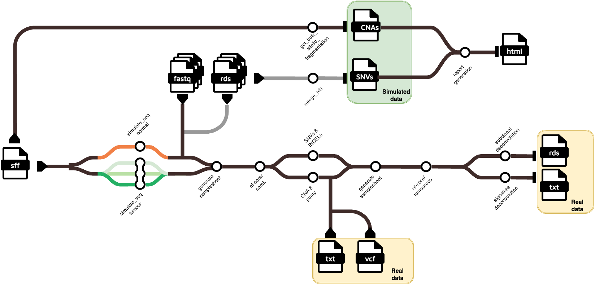

# Documentation for SCOUT cohort

## Workflow
For every SPN, the following steps are requested:

1. **`ProCESS` simulation**: perform simulation of tumour growth, sampling and mutation engine set up according to genomics information reported in [SCOUT](https://caravagnalab.github.io/ProCESS/articles/SCOUT.html) and the instruction in the [SCOUT](https://github.com/caravagnalab/ProCESS-examples/blob/main/SCOUT/README.md) section;
2. **sequencing simulation**: perform ProCESS sequencing of all 12 coverage-purity combinations (+ normal sample) following the step reporting in the [build cohort section](https://github.com/caravagnalab/ProCESS-examples/blob/main/build_cohorts/README.md)
3. **generate report** for each coverage-purity combination according to [report generation section](https://github.com/caravagnalab/ProCESS-examples/blob/main/report/README.md);
4. run **[nf-core/sarek](https://nf-co.re/sarek/3.5.1/)** for each coverage-purity combination. In particular:

    4.1 Mapping and preprocessing of normal sample;

    4.2 Mapping and prepocessing of coverage-purity combination (considered 
    as different runs)

    4.3 Variant calling of coverage-purity combinations
5. run **[nf-core/tumourevo](https://nf-co.re/tumourevo/dev/)** on nf-core/sarek results.
6. perform **validation** of nf-core/sarek results by comparing:
    
    6.1 Variant Allele Frequency of called somatic mutations (Strelka, Mutect2) vs Variant Allele Frequency of ProCESS ground truth mutations;

    6.2 Variant Allele Frequency of called germline mutations (Haplotypecaller) vs Variant Allele Frequency of ProCESS ground truth mutations;

    6.3 Purity and ploidy estimates from ASCAT given the set purity;

    6.4 Segments and karyotypes from ASCAT vs `phylo_forest$get_bulk_allelic_fragmentation` of ProCESS ground truth CNAs.

7. perform **validation** of nf-core/tumourevo results by comparing:

    7.1 Driver mutations;

    7.2 Clonal and subclonal clusters given the set ProCESS samples composition;

    7.3 Signature exposure vs `phylo_forest$get_exposures()`

8. perform plots for **resource usage**.

<h1>
  <picture>
    <source media="(prefers-color-scheme: dark)" srcset="SCOUT_workflow.png">
    
  </picture>
</h1>

## Summary table

|       step       | sub-step                |   main script   |                  output file                  | expected n of files |
|:----------------:|-------------------------|:---------------:|:---------------------------------------------:|:-------------------:|
| :green_circle: races simulation | simulate tissue         |  `0_sim_tissue.R` |           sample_forest.sff snapshot          |          2          |
| - | set mutation engine     | `1_mut_engine.R`  | phylo_forest.sff cna.rds                      | 1+n                 |
| :red_circle: build cohort     | sequencing tumour       | `build_cohort.py` | purity_{}/../seq_results_SPN{}_t{}.rds        | 3x40                |
| -                | sequencing normal       | -               | purity_1/../seq_results_SPN{}_n{}.rds../      | 1x6                 |
| -                | merginig tumour         | -               | purity_{}/../seq_results_merged_SPN{}_{}x.rds | 3x4                 |
| -                | merginig normal         | -               | purity_1/seq_results_merged_SPN{}_30x.rds     | 1                   |
| -                | fastq tumour generation | -               | purity_{}/t{}_Sample_1.{R1,R2}.fastq.gz       | 3x40x2xn            |
| -                | fastq normal generation | -               | purity_1/n{}_normal_sample.{R1,R2}.fastq.gz   | 6x2                 |
| :red_circle: sarek | mapping normal sample         |  `sarek_mapping_normal.sh` |   normal_sample.recal.cram   |        1            |
| - | mapping tumour samples         |  `sarek_mapping_{}x_{}p.sh` |   {}x_{}p/SPN{}_S{}.recal.cram   |        12xn            |
| - | mapping tumour samples         |  `sarek_mapping_{}x_{}p.sh` |   {}x_{}p/SPN{}_S{}.recal.cram   |        12xn            |
| - | variant calling strelka tumour samples         |  `sarek_variant_calling_{}x_{}p.sh` |   {}x_{}p/SPN{}_S{}.vcf   |        12xn            |
| - | variant calling mutect2 tumour samples         |  `sarek_variant_calling_{}x_{}p.sh` |   {}x_{}p/SPN{}_S{}.vcf   |        12            |
| - | variant calling haplotypecaller tumour samples         |  `sarek_mapping_normal.sh` |   SPN{}_normal_sample.vcf   |        1            |
| - | variant calling ascat tumour samples         |  `sarek_variant_calling_{}x_{}p.sh` |   {}x_{}p/SPN{}_S{}.txt   |        12xn            |
| 🟠 tumourevo | drivers      |  `` |   {}x_{}p/SPN{}_S{}.rds    |        12x2xn            |
| - | subclonal      |  `` |   {}x_{}p/SPN{}_S{}.rds    |        12x2xn            |
| - | signature      |  `` |   {}x_{}p/SPN{}.rds    |        12x2            |

> [!NOTE]
> _n_ referes to the number of samples of each SPN
> 
> 🟢: low resource usage
> 
> 🟠: medium resource usage
> 
> 🔴: high resource usage

## Folder structure

For this project we will have a data folder where all the resulting files will be stored and a copy of the remote repository. This is the expected structure of the data folder for each SPN:

```
SCOUT/SPN{id}
    ├── races
    |   ├── sample_forest.sff
    |   ├── phylo_forest.sff
    |   ├── SPN{id}
    |   └── cna_data
    |       └── <sample>_cna.rds            
    ├── sarek
    |   ├── normal_sample
    |   |    ├── multiqc
    |   |    ├── pipeline_info
    |   |    ├── preprocessing
    |   |    │   ├── markduplicates
    |   |    │   |   └── <sample>
    |   |    │   ├── recal_table
    |   |    │   |   └── <sample>
    |   |    │   └── recalibrated
    |   |    │       └── <sample>
    |   |    └── variant_calling
    |   |        └── haplotypecaller
    |   |            └── <sample>                  
    |   └── {coverage}x_{purity}p
    |            ├── multiqc
    |            ├── pipeline_info
    |            ├── preprocessing
    |            │   ├── markduplicates
    |            │   |   └── <sample>
    |            │   ├── recal_table
    |            │   |   └── <sample>
    |            │   └── recalibrated
    |            │       └── <sample>
    |            └── variant_calling
    |                ├── mutect2
    |                |   └── <patient>
    |                └── strelka
    |                   └── <sample>
    ├──tumourevo
    |   └── {coverage}x_{purity}p
    |       └── {variant_caller}_ascat
    |           ├── variant_annotation
    |           |   └── <sample>
    |           ├── signature_deconvolution
    |           |   ├── SparseSignatures
    |           |   └── SigProfiler
    |           └── subclonal_deconvolution
    |               ├── viber
    |               ├── ctree
    |               ├── pyclone                    
    |               └── mobster
    ├── validation
    |   └── {coverage}x_{purity}p
    |       ├── sarek
    |       |   ├── somatic_mutations
    |       │   |   ├── strelka
    |       │   |   └── mutect2
    |       |   ├── germline_mutations
    |       │   |   └── haplotypecaller
    |       │   └── copy_number
    |       │       └── ascat
    |       └── tumourevo
    |           └── {variant_caller}_ascat
    |               ├── drivers
    |               ├── signature_deconvolution
    |               └── subclonal_deconvolution
    ├── report
    |   └── Report_SPN{id}_{coverage}x_{purity}p.html
    └── resources
        └── 
```


