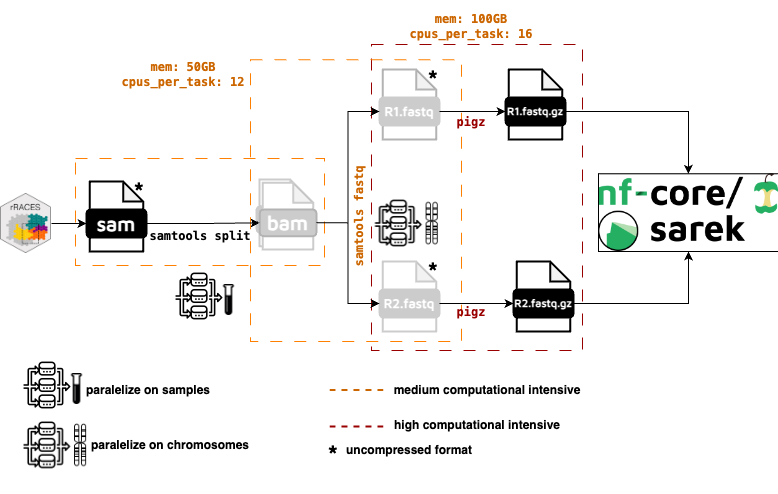

# Post-processing of rRACES sequencing files

The result of rRACES `simulate_seq` command consists in a single SAM file for each chromosome containing the simualted reads of all tumor samples and of the normal sample, by default. This information can be reatrieved in the header of the SAM file.

```
[ggandolfi@login01 rRACES_SAM]$ samtools view -H chr_1.sam
@HD	VN:1.6	SO:unknown
@SQ	SN:1	LN:248956422	AN:chromosome1,chr1,chromosome_1,chr_1
@RG	ID:SPN01_Sample_1	SM:SPN01_Sample_1	PL:ILLUMINA
@RG	ID:SPN01_Sample_2	SM:SPN01_Sample_2	PL:ILLUMINA
@RG	ID:SPN01_Sample_3	SM:SPN01_Sample_3	PL:ILLUMINA
@RG	ID:normal_sample	SM:normal_sample	PL:ILLUMINA
@PG	ID:samtools	PN:samtools	VN:1.17	CL:samtools view -H chr_1.sam
```

<p align="center">
    
</p>


## Split multisample sam files

As first step, we would like to split each sam file by sample (tumor samples). This can be mangaed using `samtools`:

```
samtools split -f %\!/%*_%\!.sam --threads 8 ${sam_file}.sam
```

This command will output in the specified folder a sam file for each record in the SM tag.

```
chr_1.SPN01_Sample_1.sam
chr_1.SPN01_Sample_2.sam
chr_1.SPN01_Sample_3.sam
```

## Convert sam to paired fastq

Sam files are converted into paired end fastq file using `samtools`:

```
samtools fastq -N $chrom.sam -1 $chrom\_$sample_id.R1.fastq -2 $chrom\_$sample_id.R2.fastq
```
The two fastq files should have the same number of reads for R1 and R2.

## Fastq merging and compression

Fastq files for each chromosomes need to merged into a single fastq file and compressed into a `.gz` format. This is a requirement prior to run `nf-core/sarek`. To do so we first cat all the fastqs and then compressed them using `pigz`, a command to perform parallel gzipping.

```
cat chr_*R1.fastq > ${sample}/${sample}_R1.fastq
pigz -p 16 ${sample}/${sample}_R1.fastq ## cpus-per-task
cat chr_*R2.fastq > ${sample}/${sample}_R2.fastq
pigz -p 16 ${sample}/${sample}_R2.fastq ## cpus-per-task
```


<!-- > **NB:** SAM header still contains the @RG from orignal header and need to be changed in order to
> keep only the SM tag specific for that sample.

### Sam file reaheadering

SAM files are reheader using the picard ReplaceSamHeader command, which requires in input the old sam file and new header in sam format. The new header is generate using a simple bash command for every sample:

```
samtools view -H $races_dir/splitted_sam/${sam_file}.normal_sample.sam | grep -v "Sample_1\|Sample_2\|Sample_3" > $races_dir/splitted_sam/${sam_file}.normal_sample_header.sam
```

The new header will be:

```
[ggandolfi@login01 SPN01]$ cat chr_1.SPN01_Sample_1_header.sam 
@HD	VN:1.6	SO:unknown
@SQ	SN:1	LN:135086622	AN:chromosome11,chr1,chromosome_11,chr_1
@RG	ID:SPN01_Sample_1	SM:SPN01_Sample_1	PL:ILLUMINA
@PG	ID:GATK SplitReads	VN:4.3.0.0-SNAPSHOT	CL:SplitReads --output /orfeo/LTS/CDSLab/LT_storage/ggandolfi/races_simulations/sequencing_80X_with_error/splitted_sam --split-sample true --input /orfeo/LTS/CDSLab/LT_storage/ggandolfi/races_simulations/sequencing_80X_with_error/chr_1.sam --split-read-group false --split-library-name false --interval-set-rule UNION --interval-padding 0 --interval-exclusion-padding 0 --interval-merging-rule ALL --read-validation-stringency SILENT --seconds-between-progress-updates 10.0 --disable-sequence-dictionary-validation false --create-output-bam-index true --create-output-bam-md5 false --create-output-variant-index true --create-output-variant-md5 false --max-variants-per-shard 0 --lenient false --add-output-sam-program-record true --add-output-vcf-command-line true --cloud-prefetch-buffer 40 --cloud-index-prefetch-buffer -1 --disable-bam-index-caching false --sites-only-vcf-output false --help false --version false --showHidden false --verbosity INFO --QUIET false --use-jdk-deflater false --use-jdk-inflater false --gcs-max-retries 20 --gcs-project-for-requester-pays  --disable-tool-default-read-filters false	PN:GATK SplitReads
@PG	ID:samtools	PN:samtools	PP:GATK SplitReads	VN:1.17	CL:samtools view -H /orfeo/LTS/CDSLab/LT_storage/ggandolfi/races_simulations/sequencing_80X_with_error/splitted_sam/chr_1.SPN01_Sample_1.sam
```
It is important to have SM tag in SAM file compatible with `patienID` and `sampleID` columns in nf-core/sarek samplesheet. In particular:

* `samplesheet.csv`

```
patient,sample,status,sex,bam,bai
SPN01,Sample_1,1,XY,SPN01_Sample_1.bam,SPN01_Sample_2.bam.bai
SPN01,normal_sample,0,XY,SPN01_normal_sample.bam,SPN01_normal_sample.bam.bai
```

* @RG filed in tumor sam:

```
@HD	VN:1.6	SO:coordinate
@SQ	SN:17	LN:83257441	AN:chromosome17,chr17,chromosome_17,chr_17
@RG	ID:SPN01_Sample_1	SM:SPN01_Sample_1	PL:ILLUMINA
```

* @RG filed in normal sam:

```
@HD	VN:1.6	SO:coordinate
@SQ	SN:17	LN:83257441	AN:chromosome17,chr17,chromosome_17,chr_17
@RG	ID:SPN01_normal_sample	SM:SPN01_normal_sample	PL:ILLUMINA
```

## Sam-to-Bam conversion

Now sam files are converted into bam files using `samtools`:

```
samtools view -@ n -Sb -o chr_1_SPN01_Sample_2.bam chr_1_SPN01_Sample_2.sam
```

## Bam sorting and indexing

Then bam file sare sorted and indexed:

```
samtools sort -o chr_1_SPN01_Sample_2_sorted.bam chr_1_SPN01_Sample_2.bam
samtools index chr_1_SPN01_Sample_2_sorted.bam
```

## Merging

Sorted bam files for each chromosome are merged togheter into a unique bam file:

```
samtools merge -c -o SPN01_Sample_2_sorted.bam chr_*_SPN01_Sample_2_sorted.bam
``` -->
