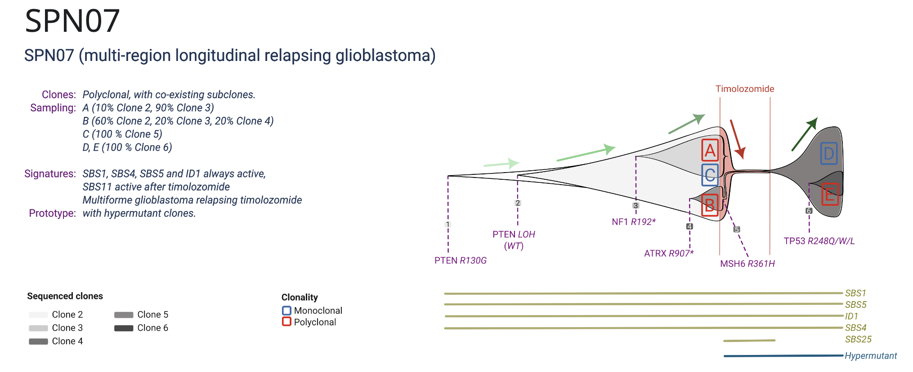

```{r setup, include=FALSE}
knitr::opts_chunk$set(echo = TRUE, warning = FALSE)
```
```{r import, include=FALSE}
rm(list = ls())
library(rRACES)
library(dplyr)
library(ggplot2)
library(ggpubr)
```

# SPN07
## Short description


## Simulation
### Tissue set up

Set up the tissue sample and allow for internal duplication.

```{r tissue_preparation}
sim <- new(Simulation, "SPN07",
           seed = 3,
           save_snapshot = F)

sim$duplicate_internal_cells <- T

sim$history_delta <- 0.5

sim$update_tissue("Liver", 2e3, 2e3)

```

### First expansion

Add 4 mutants: the second is nested in the first, the third and fourth are nested in the second independently. At the
diagnostic time the tumor is composed by clones 2,3,4 in different CCFs.

```{r first_mutants, results='hide', message=FALSE, warning=FALSE}

sim$add_mutant(name = "1",
               growth_rates = 1.3,
               death_rates = 0)


sim$place_cell("1", 1000, 1000)

sim$run_up_to_size("1",1e2)

sim$add_mutant(name = "2",
               growth_rates = 4,
               death_rates = 0)

sim$mutate_progeny(sim$choose_cell_in("1"), "2")

sim$run_up_to_size("2",1e2)


sim$add_mutant(name = "3",
               growth_rates = 6,
               death_rates = 0)


sim$mutate_progeny(sim$choose_cell_in("2"), "3")

sim$run_up_to_size("3",1e2)


sim$add_mutant(name = "4",
               growth_rates = 8,
               death_rates = 0)

sim$mutate_progeny(sim$choose_cell_in("2"), "4")


sim$run_up_to_size("4",1.1e5)


tissue_pre = plot_tissue(sim,num_of_bins  = 100)

tissue_pre

```

### Sampling at Diagnosis

We take 3 samples from the tumor with different CCFs of the 3 clones: 
Sample A (Clone 2 ~ 18 %,Clone 3 ~ 82 %), Sample B (Clone 2 ~ 73 %,Clone 3 ~  7 %,Clone 4 ~ 20 %), 
Sample C (Clone 2: 17 %,Clone 4: 73%)

```{r last_mutant, results='hide', message=FALSE, warning=FALSE}


bbox = sim$search_sample(c("3" = 1000),nw = 60,nh = 60)


sim$sample_cells("A", bbox$lower_corner, bbox$upper_corner)


forest <- sim$get_samples_forest()


bbox = sim$search_sample(c("2" = 100,"3" = 100,"4" = 100),nw = 60,nh = 60)


sim$sample_cells("B", bbox$lower_corner, bbox$upper_corner)


forest <- sim$get_samples_forest()


bbox = sim$search_sample(c("4" = 1000),nw = 40,nh = 40)


sim$sample_cells("C", bbox$lower_corner, bbox$upper_corner)


forest <- sim$get_samples_forest()

annotate_forest(forest = forest,tree_plot = plot_forest(forest),MRCAs = T)

```

### Apply Chemotherapy

We increase the death rates of all mutants to simulate the effect of the treatment.

```{r sampling_A, results='hide', message=FALSE, warning=FALSE}
sim$update_rates("1", c(death = 10))
sim$update_rates("2", c(death = 10))
sim$update_rates("3", c(death = 10))
sim$update_rates("4", c(death = 10))

sim$run_up_to_time(sim$get_clock() + 3.1)

plot_tissue(sim)

```

### De novo Resistance

A resistant Clone is nested in clone 4. Then an additional clone is nested in Clone 5.

```{r treatment, results='hide', message=FALSE, warning=FALSE}

sim$add_mutant(name = "5",
               growth_rates = 8,
               death_rates = 0)

sim$mutate_progeny(sim$choose_cell_in("4"), "5")

sim$run_up_to_size("5",1e2)

sim$add_mutant(name = "6",
               growth_rates = 11,
               death_rates = 0)

sim$mutate_progeny(sim$choose_cell_in("5"), "6")

sim$run_up_to_size("6",1.8e5)

plot_tissue(sim)

```

### Relapse

We take 2 samples from the tumor with different CCFs of the 2 resistant clones: 
Sample D (Clone 5 ~ 100 %,Clone 6  ~ 0 %)
Sample E (Clone 5 ~ 77 %,Clone 6 ~  23 %)

```{r relapse, results='hide', message=FALSE, warning=FALSE}

bbox = sim$search_sample(c("5" = 3000),nw = 60,nh = 60)

sim$sample_cells("D", bbox$lower_corner, bbox$upper_corner)

forest <- sim$get_samples_forest()

bbox = sim$search_sample(c("6" = 1000,"5" = 1000),nw = 70,nh = 70)

sim$sample_cells("E", bbox$lower_corner, bbox$upper_corner)

forest <- sim$get_samples_forest()

annotate_forest(tree_plot = plot_forest(forest),forest = forest)

```


### Summary plots

Here we report a muller plot summarizing the evolution of the tumor and the cell counts time series.

```{r muller_plot, results='hide', message=FALSE, warning=FALSE}

plot_muller(sim)

```
```{r time series, results='hide', message=FALSE, warning=FALSE}

plot_timeseries(sim)

```
